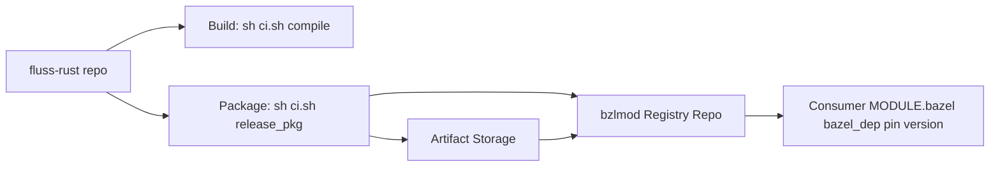

# fluss-rust Bazel Release Guide for C++ Users

Date: 2026-02-13  
Audience: C++ users, library maintainers, CI maintainers

## 1. 目标与结论

目标是用 Bazel 管理 `fluss-rust` 的发布版本，并让使用方显式锁定版本，降低版本冲突和排障成本。

核心结论：

1. `bzlmod` 的核心价值是“版本解析 + 依赖图治理 + 可复现”，你的理解方向是对的。
2. 需要补充一点：`bzlmod` 本身不是二进制包仓库，它管理的是模块元数据与源码来源；二进制上传通常是附加通道。
3. 对 C++ 使用方，建议默认走源码构建（`bazel_dep`），静态库/动态库作为补充分发形态。

## 2. 发布与消费模型

### 2.1 ASCII

```text
+----------------------+           +-------------------------------+
| fluss-rust repo      |           | artifact storage              |
| - MODULE.bazel       | --upload->| red-fluss-rust-x.y.z.tar.gz  |
| - BUILD.bazel        |           +-------------------------------+
| - bindings/cpp       |
+----------+-----------+
           |
           | generate metadata
           v
+-------------------------------+
| bzlmod registry repo          |
| modules/red-fluss-rust/       |
|   metadata.json               |
|   x.y.z/MODULE.bazel          |
|   x.y.z/source.json           |
+---------------+---------------+
                |
                v
+-------------------------------+
| consumer (e.g. RIS)           |
| MODULE.bazel                  |
| bazel_dep(red-fluss-rust, v)  |
| deps = @red-fluss-rust//:...  |
+-------------------------------+
```

### 2.2 Mermaid



## 3. 作为发布方（库维护者）

### 3.1 版本发布步骤

1. 维护版本号：发布前将根目录 `MODULE.bazel` 的 `module.version` 更新为目标版本（例如 `0.1.0`）。
2. 构建验证：执行 `sh ci.sh compile`，保证 C++ 对外目标可构建。
3. 生成 bzlmod 发布产物：

```bash
BAZEL_RELEASE_VERSION=0.1.0 sh ci.sh release_pkg
```

输出目录（默认）：

```text
dist/bzlmod-release/
  archives/red-fluss-rust-0.1.0.tar.gz
  modules/red-fluss-rust/metadata.json
  modules/red-fluss-rust/0.1.0/MODULE.bazel
  modules/red-fluss-rust/0.1.0/source.json
  modules/red-fluss-rust/0.1.0/checksums.txt
```

4. 上传源码归档（可在 CI 自动完成）：

```bash
BAZEL_RELEASE_VERSION=0.1.0 \
BAZEL_RELEASE_UPLOAD_BASE_URL=https://artifact.example.com/fluss-rust \
sh ci.sh upload_pkg
```

5. 将 `dist/bzlmod-release/modules/...` 提交到 Bazel registry 仓库。

### 3.2 CI 两阶段实践

1. 构建阶段（你指定的主入口）：

```bash
sh ci.sh compile
```

2. 上传阶段：

```bash
BAZEL_RELEASE_VERSION=${RELEASE_VERSION} sh ci.sh release_pkg
BAZEL_RELEASE_VERSION=${RELEASE_VERSION} \
BAZEL_RELEASE_UPLOAD_BASE_URL=${UPLOAD_BASE_URL} \
sh ci.sh upload_pkg
```

## 4. 作为使用方（RIS 类工程）

> 当前仓库未包含可直接引用的 RIS Bazel 工程示例；以下给出可直接落地的模板。

在使用方 `MODULE.bazel` 中显式锁版本：

```starlark
module(name = "ris")

bazel_dep(name = "red-fluss-rust", version = "0.1.0")
```

在使用方 `BUILD.bazel` 中依赖 fluss C++ target：

```starlark
cc_binary(
    name = "ris_reader",
    srcs = ["reader.cc"],
    deps = ["@red-fluss-rust//:fluss_cpp"],
)
```

版本升级流程建议固定为：

1. 修改 `bazel_dep` 版本。
2. 运行 `bazel mod tidy`。
3. 提交 `MODULE.bazel.lock`。
4. 运行业务测试。

## 5. 依赖方式选型（Static / Shared / Source）

1. Source build（默认）
   - 方式：`bazel_dep + @red-fluss-rust//:fluss_cpp`
   - 优点：依赖图一致、可复现最强、调试友好。
   - 代价：首次构建时间更长。
2. Static library（补充）
   - 方式：发布附加静态库包，消费侧通过 `cc_import(static_library=...)`。
   - 优点：构建快、交付清晰。
   - 代价：平台/工具链矩阵扩大，运维成本更高。
3. Shared library（补充）
   - 方式：发布 `.so/.dylib` 包，消费侧 `cc_import(shared_library=...)`。
   - 优点：体积小、运行时可替换。
   - 代价：ABI 和运行时加载问题更复杂。

对 C++ 用户建议：优先 Source build；只有当编译时延或平台策略明确要求时，再引入 prebuilt static/shared。

## 6. 防止“滥用”建议

1. 仅允许显式版本，不允许使用浮动策略。
2. 禁止在主干分支长期保留 `local_path_override` 或 `git_override`。
3. 要求 `MODULE.bazel.lock` 与版本变更一并提交。
4. 在 CI 增加版本守卫，确保依赖图中只有预期的 `red-fluss-rust` 版本。

可用检查命令：

```bash
bazel mod graph | rg "red-fluss-rust@"
```

## 7. 本次脚本落地内容

1. `tools/bazel/prepare_bzlmod_release.sh`
   - 生成源码归档、sha256、SRI integrity。
   - 生成 registry 所需 `metadata.json` / `MODULE.bazel` / `source.json`。
2. `ci.sh`
   - 保留 `compile`。
   - 新增 `release_pkg`、`upload_pkg`，方便 CI 串联“构建 -> 打包 -> 上传”。
